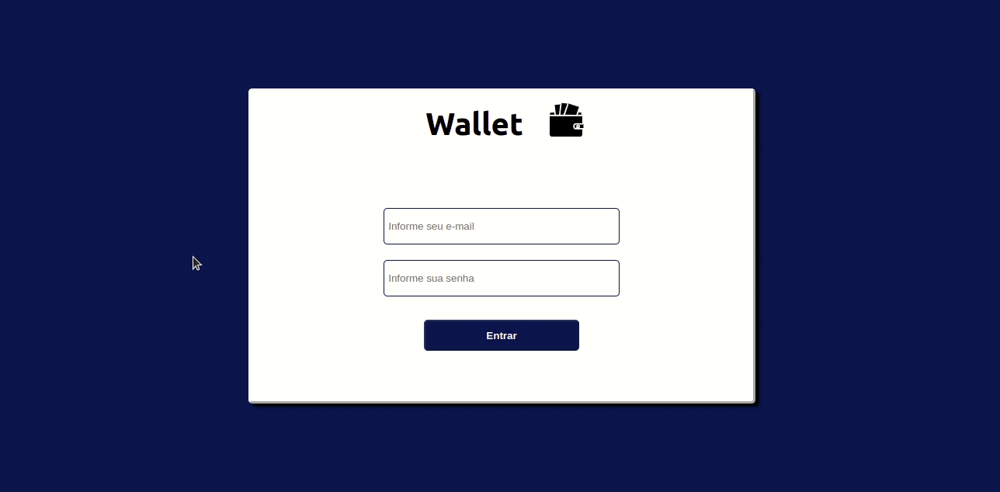
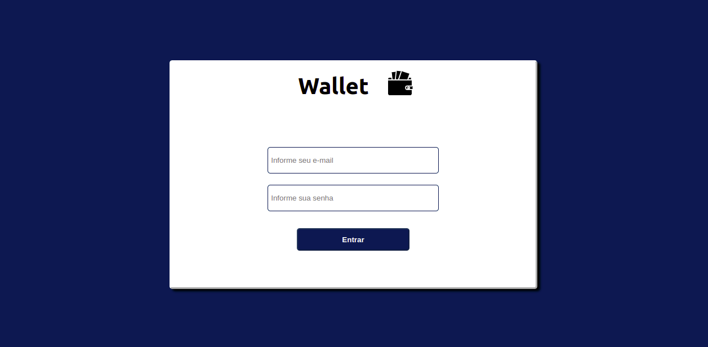
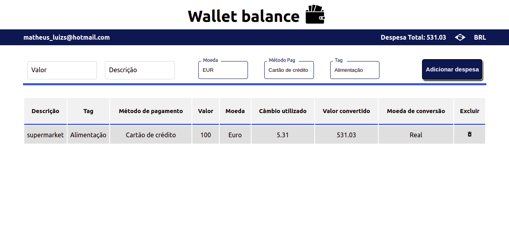
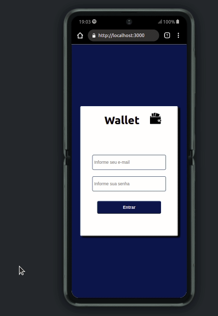

<h1 align="center"> :euro: Project Wallet :moneybag:</h1>

## 📺🖥️📱Deploy

Neste link você tem acesso ao projeto disponibilizado na web.

click aqui: https://wallet-mathluiz23.vercel.app/

## 💻 Projeto


Esse projeto consiste em uma carteira de transações. O usuário fará login com email e senha e será encaminhado para a página de carteira, então, adicionar suas despesas inserindo algumas informações, como **valor**, **descrição**, **moeda**, que é consumida através de uma _API_, onde trará os valores das cotações atuais de câmbio de acordo com a moeda selecionada, convertido para a moeda REAL(do Brasil). 

Poderá também,  inserir a **forma de pagamento** e a **tag** que é o tipo de transação.
Após cada dispesa inserida, o resumo das informações são adicionadas na tabela, onde será possível conferi-las.
O valor total das transações ficará no topo da página, para uma melhor visualização e controle do usuário. Este valor total será atualizado de acordo com cada transação inserida ou excluída. Para excluir o usuário deverá clicar no ícone de lixeira da respectiva transação inserida.

## Demonstração

<div align="center">
    
</div>

### Ações do usuário:

- Fazer login - inserir email válido, senha e clicar em entrar.

- Inserir valor da transação.

- Inserir descrição da transação.

- Informar a moeda da transação. Esta virá do retorno de uma API, onde terá o valor de câmbio atualizado e convertido para Real( moeda do Brasil).

- Inserir metódo de pagamento(Dinheiro, cartão de crédito...).

- Inserir Tag (Alimentação, lazer, transporte...).

- Poderá deletar as transações. Através do clique no ícone de lixeira de cada transação( sendo possível excluir apenas uma transação de cada vez).


## 🚪 Tela de Login




## 👨‍💻 Tela Principal Wallet




## 👷‍♂️ Habilidades

Neste projeto, foram utilizadas as seguintes habilidades:

- Utilizado `React` com Componentes de Classe, utilizando estado local e transferência de dados através de props.

- Utilizado `Redux` como ferramenta de manipulação de estados.

- Criado uma `store` Redux que irá gerenciar os estados. É núcleo de informações globais para consulta de cada ação realizada.

- Criado os `reducers` no Redux que irá registrar na store os dados das ações realizadas, modificando cada condição específica registrada.

- Criado as `actions` no Redux, que são conjuntos de informações da aplicação disparadas exatamente através de uma ação *dispatch*, que modificam o estado na store a partir dos reducers.

- Conectar Redux aos componentes React.

- Consumir uma `API`, obtendo seus dados através de um fetch em um _endpoint_ de forma assíncrona.

- Utilizado a lib interna do React, `history.push` para encaminhar para uma nova página desejada.

- Utilizar a funcionalidade `setItem`, para adicionar email do usuário no localStorage.

- Utilizado a biblioteca externa `react-icons` para inserir ícons.

---

## 📖 Documentação da API de Cotações de Moedas utilizada.

Sua página _web_ irá consumir os dados da API do _awesomeapi API de Cotações_ para realizar a busca de câmbio de moedas. Para realizar essas buscas, vocês precisarão consultar o seguinte _endpoint_:

- https://economia.awesomeapi.com.br/json/all

O retorno desse endpoint será algo no formato:
```
{
   {
     "USD": {
       "code":"USD",
       "codein":"BRL",
       "name":"Dólar Comercial",
       "high":"5.6689",
       "low":"5.6071",
       "varBid":"-0.0166",
       "pctChange":"-0.29",
       "bid":"5.6173",
       "ask":"5.6183",
       "timestamp":"1601476370",
       "create_date":"2020-09-30 11:32:53"
       },
      ...
   }
}

```
Se você quiser aprender mais informações sobre a API, veja a [documentação](https://docs.awesomeapi.com.br/api-de-moedas).


## 📱 Responsividade

  Projeto está ajustado para todos os tamanhos de tela.
  
<div align="center">
    
</div>

## 👨‍💻 Rodando o projeto localmente

Clone o projeto

```bash
  git clone git@github.com:Mathluiz23/wallet-balance.git
```

Entre no diretório do projeto

```bash
  cd wallet-balance
```

Instale as dependências

```bash
  npm install
```

Inicie o projeto

```bash
  npm start
```


